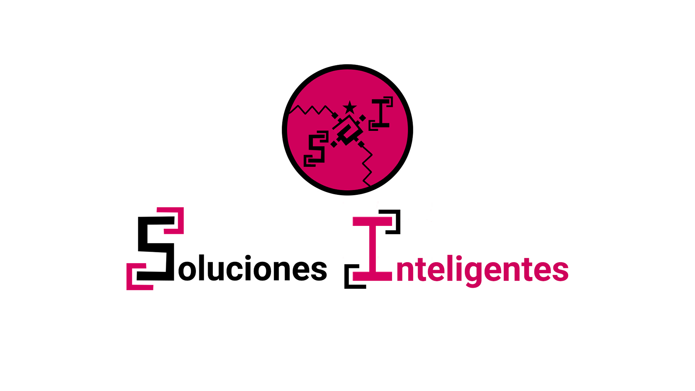
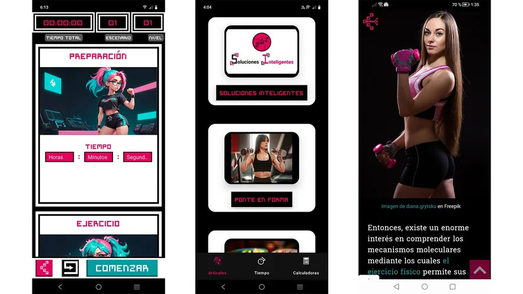
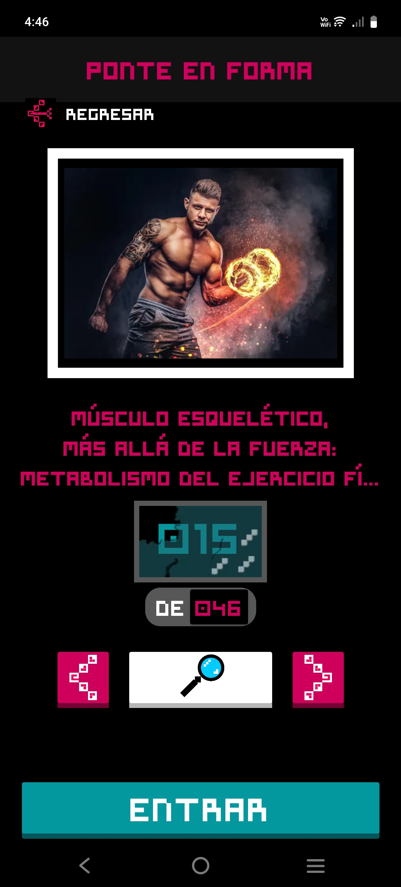
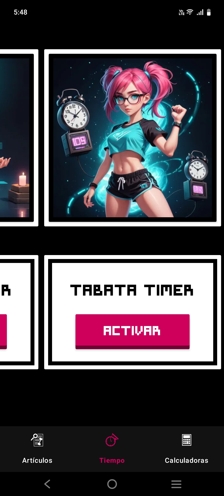
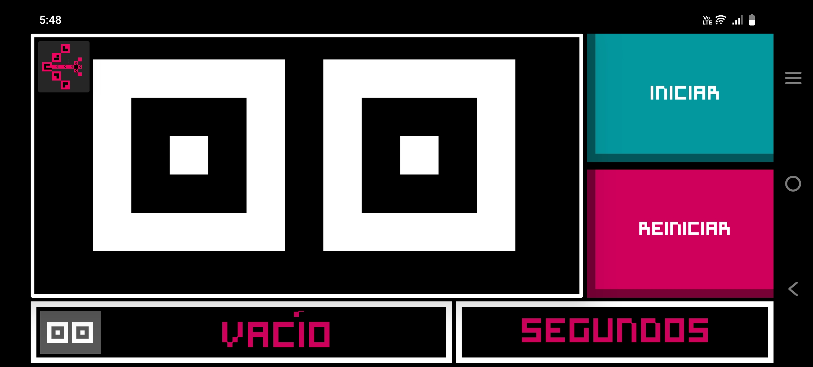
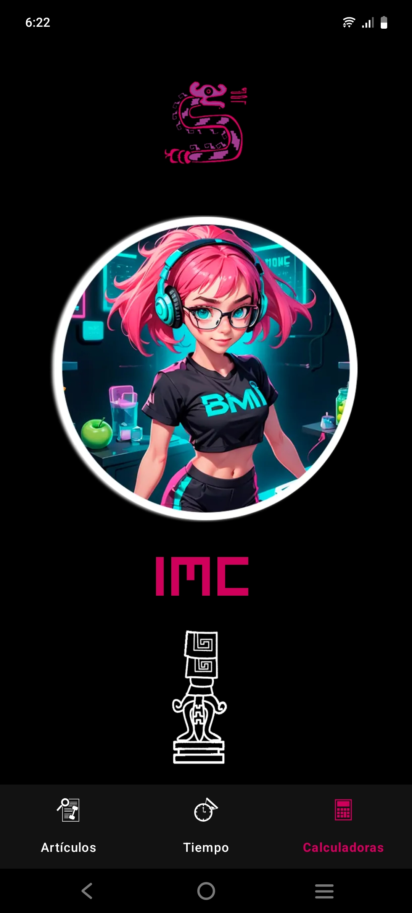

# &nbsp;Aplicación Móvil de Soluciones Inteligentes

## Descripción ❚█══█❚

Aplicación móvil Android desarrollada con Kotlin y Android Studio como parte del ecosistema Soluciones Inteligentes. Centralizaba artículos de divulgación científica sobre fitness, nutrición y salud mental, además de integrar herramientas como tabata timer y calculadora de IMC, entre otras. Estuvo disponible en la Play Store.

## Autor 💻
**Erick Roman**

* [LinkedIn](https://www.linkedin.com/in/chimallidev)
* [Portafolio](https://portafolio-chimallidev.onrender.com/)

## Vista Previa

**Artículos**

**Tiempo**

**Calculadoras**

## DEMO, Ver ejemplo en vivo

[DEMO](https://portafolio-chimallidev.onrender.com/portafolio/app-movil-soluciones-inteligentes)

## Tecnologías utilizadas

## Características

👨🏻‍🔬 **Artículos**
- Artículos de divulgación científica relacionados con promover hábitos saludables y un estilo de vida fitness.

⏳ **Tiempo**
- Crónometro
- Temporizador
- Tabata Timer

🧮 **Calculadoras**
- Índice de Masa Corporal (IMC)

## Contratación

Si quieres contratarme puedes escribirme a chimalli.dev@gmail.com para consultas.

## 🚀 Impulsa nuevos proyectos y contenido

🌌 Si te gusta esta proyecto, puedes darle una ⭐ y compartirlo con amigos.

